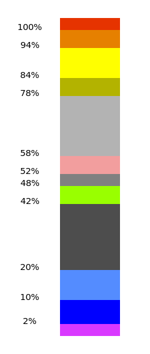

# False Color

## Introduction

False Color shows intensity in different colors to help adjust exposure.

The false color is hardcoded in an effect file `data/falsecolor.effect`.

RGB color `#000000` corresponds to 0&nbsp;IRE `#FFFFFF` corresponds to 100&nbsp;IRE.

## Properties

### Source
(Not available for False Color Filter.)

Selects one of Program, Main view, Preview, Scene, or Source.
The default is Program.

### Use LUT

Enable if you want to customize the color map.

### LUT file name

If 'Use LUT' is enabled, choose an image file for the color map.
The image file should be 1-pixel height and can have any width.
The left most pixel represents the black and the right most pixel represents the white.

An example is [available here](falsecolor-lut-default.png).

### Show key

A key will be shown.
Available options are as below.

| Option | Description |
| ------ | ----------- |
| None | The key won't be displayed. |
| Left | A vertical key will be displayed on the left side on the source. |
| Right | A vertical key will be displayed on the right side on the source. |
| Outside (Right) | A vertical key will be displayed right outside of the source. |
| Top | A horizontal key will be displayed on the top on the source. |
| Bottom | A horizontal key will be displayed on the bottom on the source. |
| Outside (Bottom) | A horizontal key will be displayed below the source. |

### Color space

Choice of color space; Auto, BT.601, or BT.709.
If Auto, the color space is retrieved from the settings of OBS Studio.
Coefficients to convert from RGB to Luminance will be changed.
Default is Auto.
